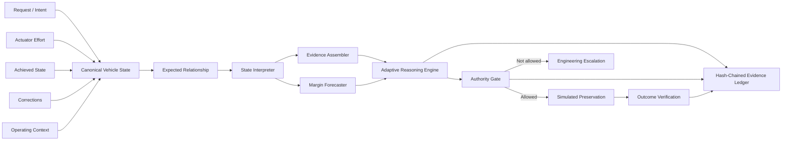

# V.I.R.A.L.™ Motorsport
## Vehicle Intelligence Reference Architecture Lab™

**A working public reference system for continuous vehicle-engineering awareness, probabilistic diagnosis and bounded preservation decisions.**

V.I.R.A.L.™ explores one question:

> **What changes when vehicle data is treated as a continuously changing engineering relationship rather than a collection of individual channels?**

The public demonstrator does not wait for a driver complaint or a hard threshold. It evaluates whether the vehicle still responds to demand in the way its current operating context predicts it should.

## Motorsport problem

A driver can report what the car feels like after a condition becomes perceptible. Engineers can then correlate telemetry, diagnose the cause and decide how to protect performance or reliability. V.I.R.A.L. Motorsport explores a complementary layer: **continuous machine-speed engineering awareness before the symptom has to reach the driver.**

The system looks for changes in relationships, not just threshold crossings. It can surface that the vehicle is requiring more control effort to achieve the same requested state, that corrections are accumulating, that recovery behavior is changing or that several individually acceptable channels no longer make sense together.

The goal is not to replace race engineers. It is to increase engineering awareness bandwidth and shorten the path from **developing condition → evidence → diagnosis → preservation decision**.

That means looking across a chain such as:

```text
DRIVER / SYSTEM REQUEST
        ↓
ACTUATOR EFFORT
        ↓
ACHIEVED VEHICLE STATE
        ↓
CORRECTIONS / COMPENSATIONS
        ↓
THERMAL + MECHANICAL RESPONSE
```

A particularly useful precursor appears when **the achieved result still looks acceptable, but the effort required to maintain it begins to change**.

The reasoning system repeatedly asks six questions:

1. **What is happening?**
2. **Why might it be happening?**
3. **Which explanation best fits all available evidence?**
4. **What will probably happen next?**
5. **How certain am I?**
6. **What engineering response could preserve the vehicle?**

A separate deterministic authority layer then decides what the reasoner is actually permitted to do.

---

## What this is designed to demonstrate

High-performance engineering already has sophisticated telemetry, specialist models and experienced engineers. V.I.R.A.L. does not attempt to teach or replace those systems.

It demonstrates an architecture for **automating engineering awareness**:

- compare requested state with achieved state
- observe whether actuator effort is changing
- evaluate correction and compensation channels
- correlate thermal and operating context
- maintain competing engineering explanations
- revise those explanations when new evidence arrives
- forecast narrowing operating margin
- recommend a bounded preservation response before failure is required to occur

The intended value is not "AI reads sensors." It is **machine-speed awareness applied to engineering knowledge**.

---

## Flagship demonstration

The included synthetic race sequence starts with a fully conformant vehicle.

No driver complaint occurs. No hard limit is crossed.

An early thermal-shaped precursor appears and the reasoner temporarily favors a thermal-management explanation. Then the relationship between requested air-charge state, actuator effort and achieved state begins to change. The achieved output initially remains acceptable even while the synthetic control effort required to maintain it rises. As new evidence arrives, the reasoner revises its preferred explanation.

Later, requested-versus-achieved response begins to diverge, correction activity increases and the projected engineering margin narrows. The authority layer permits only a **simulated bounded preservation state**, after which the verifier checks whether the synthetic vehicle returns toward its expected relationship.

```text
NORMAL OPERATION
      ↓
SUBTLE NON-CONFORMANCE
      ↓
CONTROL EFFORT CHANGES BEFORE OUTPUT FAILS
      ↓
MULTI-SIGNAL EVIDENCE ASSEMBLED
      ↓
COMPETING ENGINEERING HYPOTHESES
      ↓
NEW EVIDENCE ARRIVES
      ↓
HYPOTHESIS REVISED IF WARRANTED
      ↓
LIKELY CONSEQUENCE FORECAST
      ↓
BOUNDED AUTHORITY CHECK
      ↓
SIMULATED PRESERVATION ACTION
      ↓
OUTCOME VERIFIED
```

The public system is intentionally allowed to be uncertain. If evidence does not converge, it abstains rather than manufacture a confident diagnosis.

---

## Architecture



The architectural separation is deliberate:

**Probabilistic inference decides what the system currently believes.**

**Deterministic authority decides what the system is allowed to do.**

See [ARCHITECTURE.md](ARCHITECTURE.md) and [docs/signal_model.md](docs/signal_model.md).

---

## Three-minute technical review

If you are evaluating the architecture rather than reading documentation end to end:

1. Run `python demo.py` and watch the hypothesis revision and bounded preservation sequence.
2. Inspect `src/viral/scenario.py` for the synthetic request → effort → achieved-state sequence.
3. Inspect `src/viral/evidence.py` for supporting and conflicting evidence.
4. Inspect `src/viral/reasoning.py` for stateful belief revision and uncertainty handling.
5. Inspect `src/viral/authority.py` for the deterministic boundary around probabilistic inference.
6. Inspect `tests/test_flagship.py` for the behavior the system is required to prove.

The repository is intentionally small enough to audit quickly.

---

## Run it

Requires Python 3.11+ and no third-party runtime dependencies.

```bash
python demo.py
```

Run advisory-only authority:

```bash
python demo.py --authority A1
```

Print every frame:

```bash
python demo.py --all
```

Emit key events as JSON:

```bash
python demo.py --json
```

Run the tests:

```bash
python -m unittest discover -s tests -v
```

---

## What the demo proves

A successful run demonstrates that the public architecture can:

- ingest a continuous synthetic vehicle stream
- normalize request, actuator, achieved-state, correction and context signals
- model an expected operating relationship
- detect increased control effort before achieved performance visibly diverges
- detect non-conformance without waiting for a hard threshold
- assemble supporting and conflicting evidence
- maintain multiple competing engineering hypotheses
- revise the preferred hypothesis as evidence changes
- forecast narrowing operating margin
- abstain when confidence is insufficient
- enforce A0–A3 authority boundaries
- simulate a bounded preservation response
- verify the post-action outcome
- preserve the decision trail in a tamper-evident hash chain

The tests explicitly verify that rising synthetic control effort is detected **before requested-versus-achieved air-charge divergence**, before a simulated driver report and before a synthetic hard-limit crossing.

---

## Public scope

The signal taxonomy is informed by the structure of real performance-vehicle logging, but **every value, coefficient, threshold, weighting, scenario transition and action in this repository is synthetic and intentionally simplified**.

No private calibration file, production telemetry, manufacturer mapping or vehicle-specific engineering history is included.

V.I.R.A.L. demonstrates the architecture, evidence flow, hypothesis revision, uncertainty handling, authority model and closed-loop verification pattern. It does **not** publish production vehicle-performance algorithms, ECU control logic, calibration strategy or proprietary engineering intelligence.

See [PUBLIC_SCOPE.md](PUBLIC_SCOPE.md).

---

## Safety boundary

This repository is a software architecture demonstration. It is **not intended for direct vehicle control** and contains no production ECU-write implementation.

The A3 level in this repository means **simulated action only**.

---

## Intellectual property

**V.I.R.A.L.™** and **Vehicle Intelligence Reference Architecture Lab™** are proprietary project names and marks of **RZ1 Performance Engineering**.

© 2026 RZ1 Performance Engineering. All rights reserved.

See [IP_NOTICE.md](IP_NOTICE.md).
