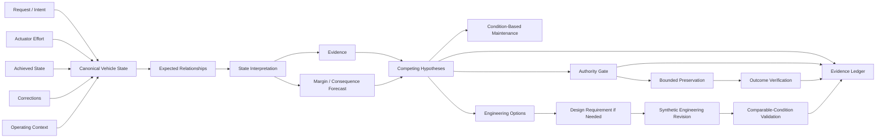

# V.I.R.A.L.™ Motorsport
## Vehicle Intelligence Reference Architecture Lab™

> **What if the vehicle did not merely generate telemetry, but continuously developed an engineering understanding of its own performance, degradation, limitations and opportunities for improvement?**

**V.I.R.A.L.™ Motorsport is a working public demonstrator for continuous vehicle engineering intelligence.**

It explores an architecture that moves beyond monitoring and fault detection into a broader engineering loop:

```text
OBSERVE → UNDERSTAND → PREDICT → PRESERVE → MAINTAIN → IMPROVE → DESIGN → VALIDATE → LEARN
```

The public implementation is synthetic by design, but the architecture is intended to show how an intelligent system can reason across the lifecycle of a high-performance vehicle rather than wait for a fault code, driver complaint or hard threshold.

---

## The engineering idea

High-performance vehicles already generate extraordinary amounts of data. The limiting factor is not always sensing. It is **continuous engineering attention**.

A human engineering team can correlate telemetry, compare runs, identify degradation, evaluate modifications and decide what to change. But no person can continuously observe every signal, interaction, historical comparison and operating condition at machine speed.

V.I.R.A.L. explores the layer between raw data and engineering action:

```text
vehicle data
    ↓
operating context
    ↓
expected relationship
    ↓
non-conformance / degradation evidence
    ↓
competing engineering hypotheses
    ↓
prediction
    ↓
preservation / maintenance / improvement decision
    ↓
engineering change
    ↓
validation under comparable conditions
```

The objective is not to replace race engineers.

**The objective is to increase engineering awareness bandwidth.**

---

## What the demonstrator actually proves

The included synthetic race sequence demonstrates a complete engineering chain:

1. **Pre-failure awareness** — rising actuator effort is detected before requested-versus-achieved performance materially diverges.
2. **Probabilistic diagnosis** — competing explanations are maintained, conflicting evidence can weaken a diagnosis and the preferred hypothesis changes when new evidence arrives.
3. **Prediction and preservation** — narrowing operating margin is projected and a bounded simulated preservation state can be requested before a hard-limit event.
4. **Condition-based maintenance** — repeated relationship drift becomes a maintenance recommendation based on observed condition rather than mileage or a single threshold.
5. **Engineering recommendation** — the same evidence is used to rank multiple engineering responses by modeled benefit and tradeoff.
6. **Design requirement generation** — when no synthetic catalog candidate satisfies the required control-effort, tracking, thermal, pressure-drop, mass and packaging constraints, V.I.R.A.L. generates a measurable design brief for a purpose-designed solution.
7. **Modification validation** — a second synthetic run applies an engineering revision under the same duty cycle and measures whether the original limitation improved or simply moved elsewhere.

> **The vehicle should not only tell engineers what happened. It should help build an evidence-backed understanding of what is happening, what is likely to happen next, what should be changed and whether the change actually worked.**

---

## One example from the live demonstrator

The public scenario begins with a conformant vehicle. An early thermal-shaped signal appears, so the reasoner initially favors a thermal-management explanation.

Then a more important relationship changes: **the vehicle requires increasing control effort to maintain the requested state while achieved performance still appears acceptable.**

New evidence arrives. The earlier explanation weakens. The system revises its diagnosis toward an air-charge / performance-control limitation.

Later:

```text
CONTROL EFFORT      +16.41%
TRACKING ERROR       0.230 bar
ENGINEERING MARGIN   0.39
PROJECTED MARGIN     0.00
```

The system requests a bounded preservation state and verifies that the synthetic vehicle begins recovering.

But V.I.R.A.L. does not stop there.

```text
CONDITION-BASED MAINTENANCE
Inspect the air-charge control path, sealing/flow path and thermal-support hardware
before the next comparable sustained high-load session.

RANKED ENGINEERING RESPONSES
1. Flow-path efficiency redesign
2. Charge-air heat-rejection upgrade
3. Calibration-only preservation envelope

DESIGN REQUIREMENT
No synthetic catalog candidate simultaneously satisfies the required control-effort,
tracking, thermal, pressure-drop, mass and packaging constraints.

Generate a purpose-designed flow/thermal support element.

MODIFICATION VALIDATION
Control effort: 15.73% → 8.18%
Tracking error: 0.141 bar → 0.093 bar
Minimum margin: 0.58 → 0.76
Replacement bottleneck detected: False
```

Every value above is synthetic. The important point is the **engineering contract** being demonstrated.

---

## Why this is different from a telemetry dashboard

V.I.R.A.L. is not intended to be another data logger, threshold alarm, OBD fault reader, static dashboard or single anomaly model.

The architecture reasons over relationships such as:

```text
DRIVER / SYSTEM REQUEST
        ↓
ACTUATOR EFFORT
        ↓
ACHIEVED VEHICLE STATE
        ↓
CORRECTIONS / COMPENSATIONS
        ↓
THERMAL + MECHANICAL RESPONSE
        ↓
OPERATING OUTCOME
```

That allows the system to detect a useful class of precursor:

> **The output still looks acceptable, but the effort required to produce it is changing.**

Individual channels can remain inside conventional limits while the relationship between them becomes non-conformant.

---

## The reasoning contract

Every reasoning cycle asks:

1. **What is happening?**
2. **Why might it be happening?**
3. **Which explanation best fits all available evidence?**
4. **What will probably happen next?**
5. **How certain am I?**
6. **What engineering response could preserve or improve the vehicle?**

A separate deterministic authority layer then asks whether an action is permitted, inside the approved envelope, reversible and justified if the reasoner is wrong.

**Probabilistic inference decides what the system currently believes.**

**Deterministic authority decides what the system is allowed to do.**

---

## Architecture



See [ARCHITECTURE.md](ARCHITECTURE.md) for the module-level design.

---

## One architecture, different deployment depth

The public reference architecture is deliberately vendor-neutral. The same contracts can be adapted to very different environments while the underlying models, data fidelity and authority change:

| Environment | Possible role |
|---|---|
| Elite motorsport / endurance / prototype programs | Continuous performance, degradation, reliability and engineering-decision support |
| OEM development vehicles | Correlation, validation, prognostics and development-loop acceleration |
| Specialist performance engineering | Modification diagnosis, upgrade evaluation and repeatable validation |
| Club racing / advanced track use | Condition awareness, preservation and maintenance guidance |
| Advanced enthusiast applications | Lower-authority engineering assistance using a smaller data envelope |

The architecture is portable. The engineering depth is deployment-specific.

---

## Three-minute technical review

1. Run `python demo.py`.
2. Watch the reasoner change its mind before the hard-limit event.
3. Inspect `src/viral/evidence.py` for supporting and conflicting evidence.
4. Inspect `src/viral/reasoning.py` for stateful probabilistic belief revision.
5. Inspect `src/viral/engineering.py` for maintenance, engineering-option ranking, design-requirement generation and modification validation.
6. Inspect `src/viral/authority.py` for the deterministic boundary around probabilistic inference.
7. Inspect `tests/` for the behavior the public system is required to prove.

The repository is intentionally compact enough to audit quickly.

---

## Run it

Requires Python 3.11+ and no third-party runtime dependencies.

```bash
python demo.py
python demo.py --authority A1
python demo.py --all
python demo.py --json
python -m unittest discover -s tests -v
```

The public test suite verifies pre-threshold detection, hypothesis revision, bounded authority, preservation verification, condition-based maintenance generation, ranked engineering responses, synthetic design-requirement generation and measurable post-modification validation.

---

## Public scope

The signal taxonomy is informed by the structure of real performance-vehicle logging, but **every value, coefficient, threshold, weighting, component candidate, scenario transition and action in this repository is synthetic and intentionally simplified**.

No production telemetry, manufacturer mapping, real calibration file, ECU-write implementation, private component-selection logic, proprietary engineering history or production diagnostic model is included.

The repository demonstrates the **architecture and engineering contracts**, not a production vehicle-intelligence product.

See [PUBLIC_SCOPE.md](PUBLIC_SCOPE.md).

---

## Safety boundary

This repository is a software architecture demonstrator. A3 means **simulated action only**. No production vehicle-control implementation is included.

---

## Intellectual property

**V.I.R.A.L.™ Motorsport** and **Vehicle Intelligence Reference Architecture Lab™** are project names and marks of **RZ1 Performance Engineering**.

© 2026 RZ1 Performance Engineering. All rights reserved.

See [IP_NOTICE.md](IP_NOTICE.md).